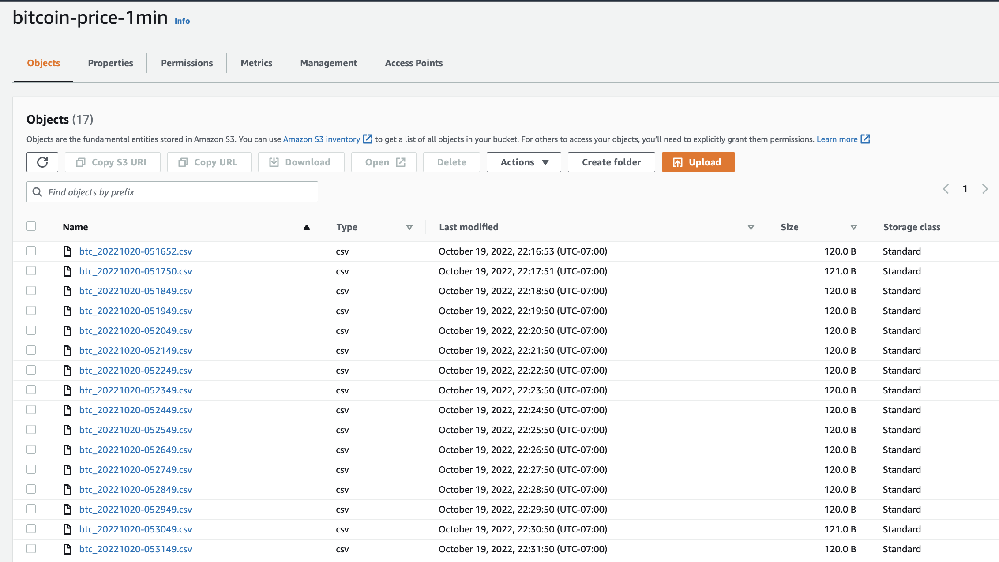

# AWS Lambda 201: 
## Overview
* An expansion of Bitcoin Project using KraKen API
* Schedule **Cron Expresions** on **AWS EventBridge** to trigger **Lambda Function** to send requests to KraKen API Daily and every minute
* Write and Store CSV Files into **S3 bucket**
* Zip requests package and add to lambda function **layer**
* Add AWSSDKPandas-Python39 layer for pandas
* Create **IAM role** for lambda and attach **policy** on S3 and **CloudWatch Logs**



```
import json
import requests
from datetime import datetime, time
import pandas as pd
import boto3
from io import StringIO

bucket = "bucket_name"

def lambda_handler(event, context):
    resp = requests.get('https://api.kraken.com/0/public/OHLC?pair=XBTUSD&interval=1&since=unix_now').json()
    kraken_ohlc_cols = ["date","open", "high", "low", "close", "vwap","volume", "trades"]
    df = pd.DataFrame([resp['result']['XXBTZUSD'][-1]], columns=kraken_ohlc_cols)
    df["date"] = pd.to_datetime(df["date"],unit='s') 
    print(df)
    
    csv_buffer = StringIO()
    df.to_csv(csv_buffer)
    s3_resource = boto3.resource('s3')
    file_name = datetime.now().strftime("%Y%m%d-%H%M%S")
    s3_resource.Object(bucket, f'btc_{file_name}.csv').put(Body=csv_buffer.getvalue())
    
    return {
        'statusCode': 200,
        'body': json.dumps('Hello from Lambda!')
    }

```


 
